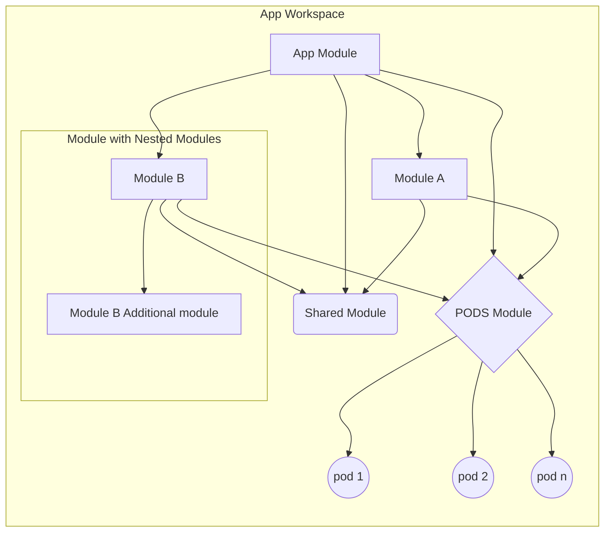

# Modularized Test App
This is a test project created for the modularization test purposes. The app structure is defined in the next diagram.

App Structure
---

```mermaid
%%{ init: { 'flowchart': { 'curve': 'natural' } } }%%
graph BT
subgraph  App Workspace
A[App Module] --> B[Module A]
A --> C[Module B]
subgraph Module with Nested Modules
C --> C1[Module B Additional module]
end
A & B & C --> D(Shared Module)
A & B & C --> E{PODS Module}
E --> F((pod 1)) & G((pod 2)) & H((pod n))
end
```